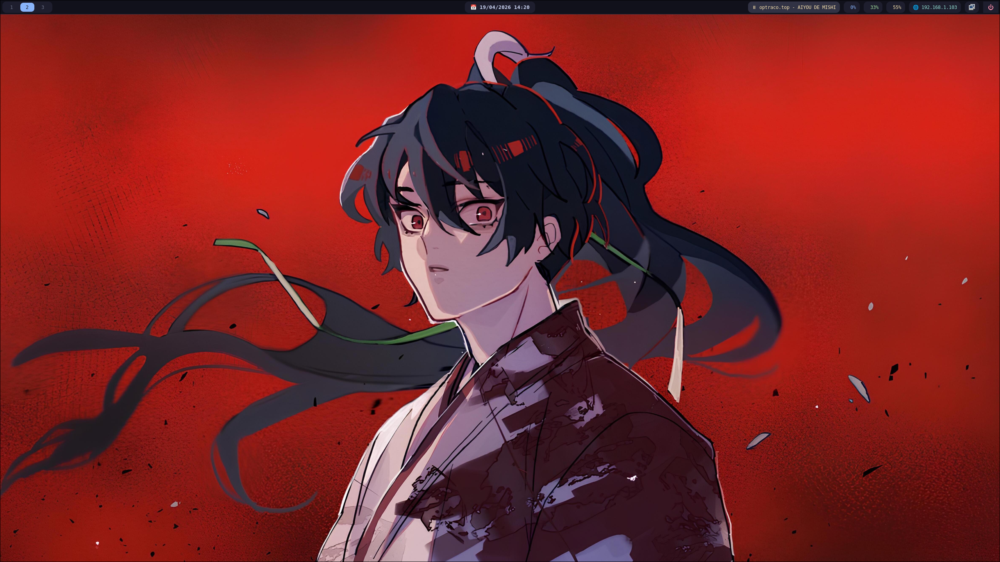
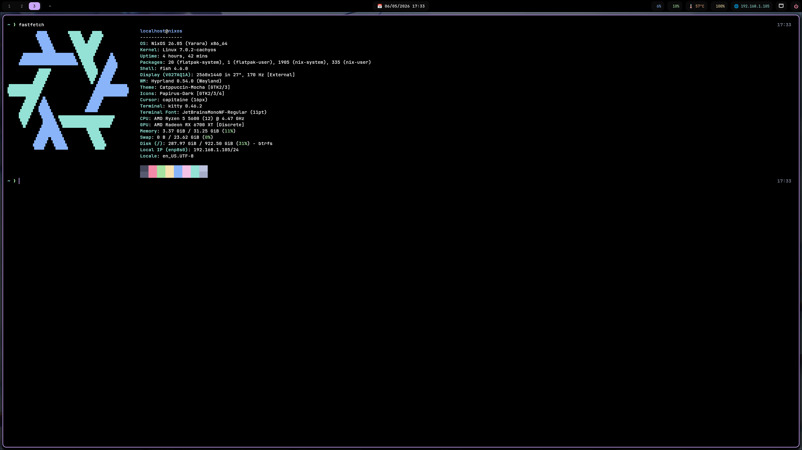
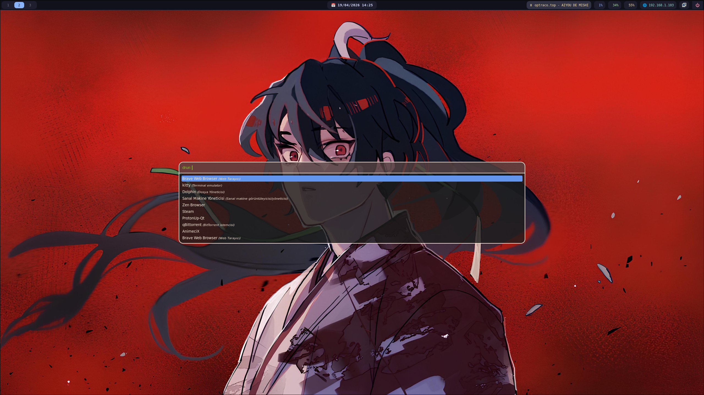
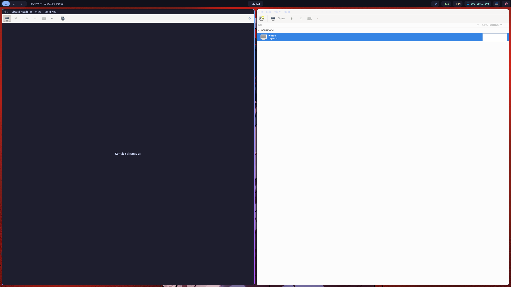

# NixOS Hyprland Gaming + VFIO (AMD-Optimized)

<p align="center">
  
  
</p>
<p align="center">
  
  
</p>

> ⚠️ **Advanced setup** – requires familiarity with Nix Flakes, Wayland and low‑level system configuration.

A fully declarative NixOS configuration that merges a clean Wayland desktop, AMD‑tuned gaming performance and **single‑GPU passthrough** for a Windows VM into one reproducible system.

---

## Tested Hardware

| Component | Model |
|-----------|-------|
| CPU       | AMD Ryzen 5 5600 |
| GPU       | AMD Radeon RX 6700 XT |
| RAM       | 32 GB DDR4 |
| Storage   | NVMe SSD |
| Arch      | x86_64-linux |

---

## Key Features

### Kernel & Boot
- **CachyOS BORE kernel** via `xddxdd/nix-cachyos-kernel` overlay
- AMD optimisations: `amd_pstate=active`, `amd_iommu=on`, `iommu=pt`, `amdgpu.ppfeaturemask=0xfffd7fff`
- Low latency: `rcupdate.rcu_expedited=1`, `nowatchdog`, `nmi_watchdog=0`
- AppArmor enabled

### Gaming Stack
- Steam with Proton‑GE
- GameMode (nice -10, I/O priority 0, GPU high performance, custom hooks for mpvpaper)
- MangoHud, Gamescope, ProtonUp‑Qt, Heroic
- RADV Vulkan: `AMD_VULKAN_ICD=RADV`, `RADV_PERFTEST=gpl,nggc`
- Hyprland tweaks: `allow_tearing=true`, `vrr=2`, per‑game window rules

### Audio
- PipeWire low‑latency: 48 kHz, quantum 128 (min=max=128, max=256)
- ALSA, PulseAudio, JACK compatibility via PipeWire
- WirePlumber + rtkit

### Storage – LUKS2 + Btrfs
- Full disk encryption (LUKS2)
- Btrfs subvolumes: `@`, `@home`, `@nix`, `@log`, `@snapshots`
- Mount options: `compress=zstd:1`, `noatime`, `discard=async`, `space_cache=v2` (`/nix` nodatacow)
- Snapper hourly snapshots with automatic cleanup
- Monthly scrub, zramSwap (zstd) + disk swap

### Desktop
- Hyprland 0.54 (Wayland) + greetd/Tuigreet (no X11)
- Waybar with custom modules (CPU, RAM, temp, GameMode, MPRIS, network)
- Dunst, Rofi, Hypridle/Hyprlock, mpvpaper (video wallpaper)

### Shell & Tools
- Fish + Starship, Zoxide, fzf, eza, bat, ripgrep, fd
- btop, nvtop (AMD), fastfetch, convenient aliases

### Theme
- Catppuccin Mocha GTK, JetBrainsMono Nerd Font, Capitaine Cursors, Papirus Dark icons

### AI Integration
- Ollama on ROCm (`ollama-rocm`), runs continuously

### VFIO / GPU Passthrough
- Declarative libvirt hook managed entirely by Nix
- `prepare`: stops greetd, unbinds GPU → vfio-pci, logs to `/var/log/libvirt/vfio.log`
- `release`: rebinds GPU, restarts greetd
- Single‑GPU: host display goes black – use Looking Glass or SPICE

### Security
- AppArmor, Fail2ban (3 SSH failures → 48h ban)
- SSH password auth disabled, root login forbidden, firewall enabled

### Integration
- KDE Connect, Waydroid, Flatpak + GNOME Software, Virt‑Manager + Looking Glass

---

## Repository Structure
├── assets/ # screenshots
├── install.sh # Safe automated setup script
├── nixos/
│ ├── flake.nix
│ ├── flake.lock
│ ├── configuration.nix
│ └── home.nix
├── vm-xml/ # optional Windows VM XML examples
├── wallpaper/ # sample live wallpapers
├── cs2.cfg / csgo.cfg # game configs
├── KURULUM.md # Turkish installation guide
└── README.md

text

> **Note:** `hardware-configuration.nix` is **not** included – it must be generated per machine.

---

## Installation

1. **Clone the repository**
   ```bash
   git clone https://github.com/kUmutUK/Declarative-NixOS-Gaming-VFIO-Setup-Hyprland-AMD-GPU-Passthrough-.git
   cd Declarative-NixOS-Gaming-VFIO-Setup-Hyprland-AMD-GPU-Passthrough-
(Fresh install only) Generate hardware config

bash
sudo nixos-generate-config
The generated hardware-configuration.nix must contain your disk UUIDs.

Run the safe setup script

bash
chmod +x install.sh
./install.sh
It will backup your old configs, copy the new files, and ask you for:

GPU PCI addresses

Monitor output name

Hyprland monitor line

Git user details
Safe sed substitutions are applied automatically.

Create your hashed password

bash
mkpasswd -m sha-512 | sudo tee /etc/nixos/hashedPassword
Verify hardware‑specific changes (non‑AMD systems)
The script will show you what to change manually.

Rebuild

bash
sudo nixos-rebuild switch --flake /etc/nixos#nixos
Post‑Install
Waydroid: waydroid init -f

AI model: ollama pull llama3

Check VFIO logs: cat /var/log/libvirt/vfio.log

Usage
Gaming
bash
mangohud gamemoderun gamescope -f -- %command%
VFIO VM
Start your VM via virt-manager – the hook handles the rest.

Snapper & Maintenance
bash
snap-root    snap-home    btrfs-df
nrs          nup          nclean
Non‑AMD Hardware
Component	Required Changes
Intel CPU	Replace kvm-amd → kvm-intel, amd_iommu → intel_iommu, remove amd_pstate
NVIDIA GPU	Change videoDrivers to nvidia, add hardware.nvidia.modesetting.enable, remove AMD env vars, switch ollama to ollama-cuda
Intel iGPU	Use modesetting driver, remove AMD‑specific parameters, ollama to CPU
Important Notes
Single‑GPU VFIO: host display goes dark during VM.

GPU IDs: update gpuPCI and gpuAudio in configuration.nix (the installer does this).

SSH: password auth disabled – add your key with ssh-copy-id localhost@nixos.

Default user: localhost

License
MIT — see LICENSE file.

Maintainer: kUmutUK
