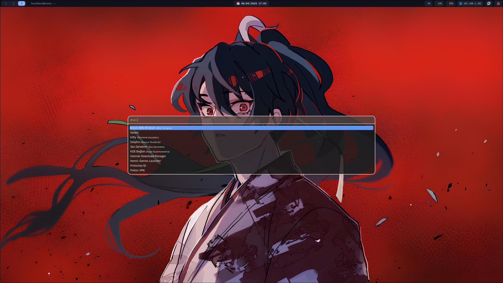

# NixOS Hyprland Gaming Config (AMD Optimized • Flake)



## 🎯 Purpose

A **high-performance, low-latency NixOS configuration** designed for gaming and daily use.
Delivers a **smooth, fast, and stable experience** with minimal input lag and no extra tweaking.

---

## 💻 Target Systems

Best suited for:

* 🟢 AMD CPUs (Ryzen recommended)
* 🟢 AMD GPUs (RADV / Mesa)
* 🟢 Wayland + Hyprland
* 🟢 Desktop systems (SSD / NVMe)

---

## 🚀 Features

* Hyprland (Wayland compositor)
* Waybar (custom UI)
* Low-latency PipeWire audio
* GameMode enabled
* MangoHud + Gamescope
* Steam + Proton ready
* Waydroid support
* KDE Connect
* USB autosuspend disabled (no mouse/keyboard sleep)
* Optimized kernel parameters

---

## ⚡ Installation (Flake)

```bash
git clone https://github.com/YOUR-USERNAME/NixOS-Hyprland-Gaming-Config-AMD-Optimized
cd NixOS-Hyprland-Gaming-Config-AMD-Optimized
sudo nixos-rebuild switch --flake .#nixos
```

---

## 📂 Repository Structure

```
NixOS-Hyprland-Gaming-Config-AMD-Optimized/
├── flake.nix
├── flake.lock
├── configuration.nix
├── hardware-configuration.nix
├── home.nix
├── hypr/
│   ├── hyprland.conf
│   └── hyprlock.conf
├── waybar/
│   ├── config
│   └── style.css
├── nix/
│   ├── nix.conf
│   └── registry.json
├── README.md
```

---

## 🖥️ Hyprland Setup (Manual)

```bash
mkdir -p ~/.config/hypr
cp -r hypr/* ~/.config/hypr/
```

---

## 📊 Waybar Setup (Manual)

```bash
mkdir -p ~/.config/waybar
cp -r waybar/* ~/.config/waybar/
```

---

## ⚙️ Nix Configuration (Advanced / Optional)

⚠️ **WARNING:**
These files are **system-level configurations** and may break your system if used incorrectly.

* Not required for normal usage
* May override your system defaults
* Only use if you know what you're doing

Apply manually:

```bash
sudo cp -r nix/* /etc/nix/
```

---

## 📸 Screenshots

*(Add your desktop screenshot here)*

---

## 🏷️ Recommended Topics

```
nixos hyprland wayland linux dotfiles gaming amd flakes
```

---

## 📌 Notes

* Focused on **performance over battery life**
* Designed for **desktop systems**
* Minimal setup required after installation

---

## 🔥 Goal

A **clean, fast, minimal, and powerful NixOS setup** for gaming and everyday use.